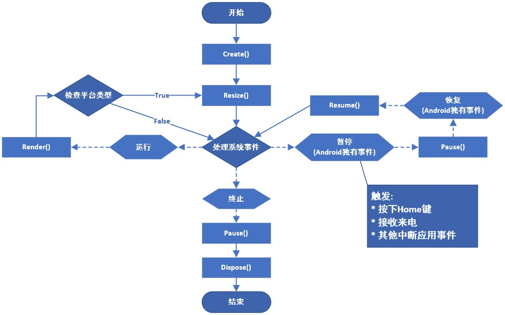

# LibGDX游戏开发指南 (第二版)

* [快速链接](D:/StudentFile/图灵程序设计丛书/LibGDX游戏开发指南_第二版.pdf)

* Desktop 项目打包

```cmd
gradlew desktop:dist
```

## 第六章 添加演员 P141

* 确保当前速度没有超过正负最大值
`velocity.x = MathUtils.clamp(velocity.x, -terminalVelocity.x, terminalVelocity.x);`

## 第五章 建造场景

SpriteBatch.draw()方法

```java
void com.badlogic.gdx.graphics.g2d.SpriteBatch.draw(Texture texture, 
float x, float y, //渲染到屏幕的指定位置
float originX, float originY, // 锚点定义了矩形变换时的相对位置
float width, float height,  // 定义了渲染时的尺寸
float scaleX, float scaleY,  //缩放因子, 定义了矩形相对锚点的缩放倍数
float rotation, // 相对锚点的旋转角度
int srcX, int srcY, int srcWidth, int srcHeight, //从纹理集上截取一块矩形区域
boolean flipX, boolean flipY // 设置纹理是否在水平和垂直方向上惊现渲染
)
```

## 第四章 资源打包 P100

* 游戏资源用于为游戏创建更加出色的视觉和听觉效果.
* 纹理集的概念, 以及在LibGDX中如何使用纹理集技术
* 了解运行期追踪资源的重要性, 以及如何无忧无虑地将资源管理任务委派给libGXD.
* 无忧无虑表示我们不用担心资源的卸载和重载
* 只需要告知LibGDX需要载入什么资源, 然后libGDX会在后台自动管理资源, 这些资源总是透明的, 可以直接访问.
* 如何创建自定义的Assets类, 该类允许我们在任何位置访问游戏资源

### 4.1 替换Android应用图标

### 4.2 替换IOS应用图标

### 4.3 创建纹理集

* 纹理集(sprite sheet) 本质是一张普通的图片文件, 可以向其他图片一样直接被渲染到屏幕上.
* 纹理集会被当成一种图片容器来使用, 该容器包含许多较小的子图片, 为了避免覆盖, 这些字图片会按照一定方式进行排列, 排列之后的尺寸总是小于纹理集的最大尺寸.
* 对显卡而言, 切换纹理是一项非常耗时的任务,而纹理集技术可以避免频繁切换纹理, 大大减少了发送到显卡的纹理数量, 显著提高了游戏的渲染效率.
* 纹理集尤其适合那些包含许多小尺寸, 多种类纹理的应用.
* 在渲染过程中, 每次切换纹理, 新的纹理数据都需要重新发送到显卡.
* 但如果每次渲染都是用同一张纹理, 就可以避免这个过程.
* 使用纹理集技术不仅是为了增加帧率, 还允许我们使用 Non-Power-Of-Two(NPOT)纹理.
* 因为power-of-two规则只适合发送到显卡的纹理.
* 当渲染一个NPOT子纹理时, 使用的仍是同一个适合power-of-two规则的纹理(纹理集)资源,真正被渲染到屏幕上的只是该纹理(纹理集)的一部分而已
* 因为OpenGL ES2.0 默认是支持NOPT纹理的, 因此libGDX也支持NOPT纹理.
* 但渲染一个NOPT纹理要比渲染一个POT纹理费时的多
* 及时不考虑渲染性能, 纹理集也是非常有用的, 因为显卡会将纹理集当成一个独立的单元进行处理.
* 而且绑定一个大尺寸纹理要比绑定多个小尺寸纹理快的多
* LibGDX提供了一个TextuePacker工具, 允许很方便的创建, 更新纹理集资源
* 所有图片不重叠地排列在一张纹理集中
* 紫色边框是TexturePacker工具提供的线框调试功能, 可以手动开启和关闭该功能.
* 线框调试可以反映每张子图片的真实尺寸, 而避免由于图片包含透明像素而无法识别边界的问题.
* 激活padding属性时, 子图片的每个方向默认添加两个像素的间隔. 如果没有开启线框调试功能, 则padding属性产生的间隔效果很难被发现.
* 在纹理集中, 为每张子图片添加间隔像素能有效第避免纹理过滤和mip贴图长生的 texture bleeding (或 pixel bleeding) 效应.
* 纹理过滤用于平滑纹理像素, 平滑的原理是使用当前像素和下一个像素的颜色综合计算出当前像素的颜色.
* 如果下一个像素是相邻图片的内容, 则平滑处理的结果就会失真, 即注明的 texture bleeding效应
* 使用 TexturePacker 类之前, 需要添加 com.badlogic.gdx:gdx-tools 到 desktop 项目中
* 添加打包纹理集的代码
  * 为 desktop 项目 创建 assets-raw 文件夹, 然后

* 这里有个坑, 书上说加载资源的地址 `images/canyonbunny.pack` 但实际上, 加载资源的地址应该是 `images/conyonbunny.pack.atlas`

## 第三章 配置游戏

* 使用gdx-setup-ui工具创建Canyon Bunny游戏项目
* 学习游戏框架的设计
* 测试基础代码

### 3.2 设计

* CanyonBunnyMain 主类 实现 ApplicationListener接口
  * 封装了 Assets 类的引用 Assets类用于组织和访问游戏资源
* WorldController 类, 包含用于初始化游戏和切换游戏状态的所有逻辑
  * CameraHelper 封装了所有相机操作的助手类, 如设置相机目标, 跟踪游戏对象
  * Level类封装了关卡数据德国内容
  * 负责游戏场景的渲染任务, 所以此类需要访问每个AbstractGameObject对象

### 3.3 基础部分

* 基础版本的 CanyonBunnyMain 类, WorldController 类, WorldRenderer 类, 存储常量的 Constants 使用类
* 实现Constants类
  
详见项目代码

## 第二章 跨平台开发  一次构建, 多平台部署

* 解析LibGDX项目的基本内容以及Eclipse是如何组织多个子项目一起工作的.
  * 后端
  * 模块
  * 应用生命周期和接口
  * 启动类

### 2.2 LibGDX 后端

* 通过创建多个用于(接口)连接相应平台的后台运行库来为应用提供跨平台支持. 当应用调用LibGDX的某个抽象方法时, LibGDX将自动访问对应平台的某个功能模块, 这些模块就成为后端.

#### 2.2.1 轻量级的Java游戏库(Lightweight Java Game Library, LWJGL)

旨在降低开发桌面平台游戏时访问硬件资源的难度. LibGDX使用LWJGL作为桌面平台的后端是为了支持当前主流桌面操作系统, 如Windows

### 2.3 LibGDX 核心模块

* 提供了六个核心模块用于访问系统的各个部分.
* 对于开发者来说, LibGDX通过一套通用的应用编程接口(Application Programming Interface, API)让应用在每个支持的平台获得相同的执行效果
* LibGDX 提供的API 被分为几大逻辑模块, 每个模块都已经定义为Gdx类的static字段, 所以在项目的任何位置都可以直接访问
* LibGDX允许依据平台创建多条代码路径, 例如, 可以增加项目在桌面平台上的复杂度, 以利用桌面平台更加丰富的硬件资源

#### 2.3.1 应用模块

* 应用模块可以通过Gdx.app访问. 用于日志管理, 安全关闭, 永久存储, 查询Android API 版本, 查询平台类型以及查询内存使用情况.
* 日志管理
  * 内建的日志管理器. 通过设置日志级别来过滤打印到控制台的日志信息, 默认: LOG_INFO
  * 日志级别可以通过配置文件设置, 也可以通过代码在线设置.
    * gdx.app.setLogLevel(Application.LOG_DEBUG);
    * 日志级别:
      * LOG_NONE: 完全不打印日志, 也不显示任务日志记录
      * LOG_ERROR: 只打印错误级别日志
      * LOG_INFO: 打印错误级别日志和信息级别日志
      * LOG_DEBUG: 打印所有级别的日志
  * info :  Gdx.app.log()
  * debug : Gdx.app.debug()
  * error : Gdx.app.error()
* 安全关闭
  * 在运行期, 直接通知LibGDX关闭当前应用. 当LibGDX收到关闭命令时, 框架将尽可能安全地停止运行应用并回收仍在使用的内存资源, 释放Java堆和原生堆.
  * Gdx.app.exit();
  * 当需要结束应用时, 应该调动安全的关闭方法; 否则, 可能会导致内存泄漏, 这是一件非常糟糕的事情. 对于移动设备, 由于内存资源本来就很短缺, 因此内存泄漏显得非常危险.
  * 在 Android 平台, exit() 方法会在恰当的时间调用 puse() 方法和 dispose() 方法, 而不是立刻结束应用.
* 永久存储
  * 如果希望在退出应用后还能永久保存数据, 则应该是用 Preferences 类进行数据管理.
  * 该类可以看成一种能将键-值对保存到文件中的字典.
  * 如果磁盘不存在 Preferences 类将要保存的文件, LibGDX将会创建一个新文件.
  * 如果需要分类保存数据, 也可以创建多个参数文件, 但是每个参数文件的名称必须是独一无二的.
  * 访问参数文件之前, 首先需要按照下面的代码创建Preferences对象:
    * Preferences prefs = Gdx.app.getPreferences("settings.prefs");
  * 保存数据时, 首选需要为改数据选择一个键. 如果字典中存在相应的键值, 则原有数据会被覆盖.
  * 当所有数据保存完成后, 最后调用flush()方法将数据写入文件. 如果忘记调用flush()方法, prefs将不会保存任何数据
    * prefs.putInteger("sound_volume",100); // volume @ 100%
    * prefs.flush();
  * 永久保存数据比在内存中存取数据要慢很多, 因此, 最好在所有数据修改完成之后, 在调用flush()方法写入文件.
  * 如果需要从参数文件中读取一个数据, 首先需要知道改数据对应的键值.
  * 如果键值不存在, 则返回默认值.
    * int soundVolume = prefs.getInteger("sound_volume", 50);
* 查询Android API 级别
  * 对于Android平台, 可以查询操作系统的版本, 根据具体的版本执行不同代码
  * Gdx.app.getVersion();
  * 对于其他平台, 该方法返回的总是0
* 查询平台类型
  * 编写平台相关的代码需要运行期查询平台类型

```java
switch (Gdx.app.getType()){
    case Desktop:
        // 针对Desktop系统的代码
        break;
    case Android:
        // 针对Android系统的代码
        break;
    case WebGL:
        // 针对WebGL系统的代码
        break;
    case iOS:
        // 针对iOS系统的代码
        break;
    default:
        // 未知平台
        break;
}
```

* 查询内存使用情况
  * 在运行期, 可以直接使用代码查询应用的内存使用情况.
  * 及时发现应用是否过度使用内存, 以防止应用崩溃
  * long memUsageJavaHeap = Gdx.app.getJavaHeap(); // Java堆已经占用的内存大小
  * long memUsageNativeHeap = Gdx.app.getNativeHeap();  // 原生堆已经占用的内存大小
* 多线程支持
  * 应用开始时, LibGDX首先创建一个独立的关联着OpenGL上下文的主线程(main loop thread). 所有事件处理, 渲染过程都在该线程内执行, 不会进入UI线程.
  * LibGDX是支持多线程的, 将其他线程的数据传递到主线程, 需要使用到 Application.postRunnable() 方法

```java
new Thread(new Runnable(){
    @Override
    public void run(){
        // 完成其他线程任务
        final Result result = getResult();
        // 将result 通过Runnable推送到主线程
        Gdx.app.postRunnable(new Runnable(){
            @Override
            public void run(){
                // 产生结果
                results.add(result);
            }
        });
    }
}).start(); 
```

### 2.3.2 图形模块

* 图形模块可以通过 Gdx.getGraphics()方法访问, 也可以通过Gdx.graphics 静态常量访问
* 查询增量时间
  * 增量时间表示最后一帧和当前帧的时间跨度
  * Gdx.graphics.getDeltaTime() 方法
* 查询显示器尺寸
  * Gdx.graphics.getWidth() 和 Gdx.graphics.getHeight() ,  返回值的单位为像素
* 查询帧率(FPS)
  * LibGDX内建的帧率计数器
  * Gdx.graphics.getFramesPerSecond()

### 2.3.3 音频模块

* 音频模块可通过 Gdx.getAudio()  和 Gdx.audio 访问
* 重播音频
  * Gdx.audio.newSound() 方法创建
  * LibGDX支持的音频格式包括: WAV, MP3 和 OGG,  但IOS不支持OGG格式.
  * LibGDX对音频的解码数据量有限制, 最大不能超过1MB.
  * 对于重播音频, 建议使用较短的音频文件, 如子弹, 爆炸等声音效果, 可以避免数据量的限制
* 流媒体音频
  * Gdx.audio.newMusic() 方法创建

### 2.3.4 输入模块

* 通过 Gdx.getInput()  和 Gdx.input 访问
* 为了接收和处理输入事件, 必须创建一个实现了InputProcessor 接口的实例, 然后调用Gdx.input.setInputProcessor()方法, 将该实例设置为全局输入事件处理器
* 获取按键, 触摸, 鼠标事件
  * Gdx.input.getX() 方法 和 Gdx.input.getY()方法可以获取最后一次输入时间发生的坐标. 坐标x和y是以窗口左上角为原点定义的.
  * Gdx.input.isTouched() 方法 用于测试屏幕触摸事件
    * 该方法还有一个支持多点触控的重载类型 Gdx.input.isTouched(int pointer),  pointer参数用于指定测试点, 默认0.
    * Gdx.input.isTouched() 也可以测试鼠标事件, 但是该方法不能区分鼠标事件的触发按键
  * Gdx.input.isButtonPressed(int button) 真测试鼠标事件的方法
    * button 参数用于指定测试按键,  可选: Buttons.LEFT(左键), Buttons.RIGHT(右键), Buttons.MIDDLE(中键)
  * Gdx.input.isKeyPressed(int key) 用于测试键盘输入时间
    * 可选的key(键)值全部定义在 Input.Keys 类中
    * Gdx.input.isKeyPressed(Input.Keys.ENTER) 用于测试Enter键是否按下, 返回true表示Enter键按下.
* 读取加速度
  * LibGDX中, 可以查询x,y,z三个方向上的加速度. 对于桌面平台, 这三个函数始终返回0
  * Gdx.input.getAccelerometerX();
  * Gdx.input.getAccelerometerY();
  * Gdx.input.getAccelerometerZ();
* 振动器的启动与停止
  * 对于Android设备
  * Gdx.input.vibrate() 启动振动器
  * Gdx.input.cancelVibrate() 停止振动器
* Android 系统的软按键
  * 捕获Android系统的软件按键事件, 然后自定义事件处理的代码.
    * 如果希望自定义处理返回按钮的代码, 必须事先调用 Gdx.input.setCatchBackKey(true) 方法
    * 要捕获菜单按钮事件, 需调用 Gdx.setCatchMenuKey(true) 方法
  * 使用鼠标的桌面系统, 通过 Gdx.input.setCursorCatched(true) 方法 让应用获得永久的鼠标输入, 即使鼠标离开当前应用, 也可以捕获到鼠标事件.

### 文件模块

* Gdx.getFiles() 和 Gdx.files
* 获得内部文件句柄
  * 获得内部文件句柄可以使用 Gdx.files.internal() 方法
  * 对于 Android 和 WebGL 平台, 内部文件以assets文件夹为根目录存储
  * 对于 桌面 平台, 这些文件相对于应用根目录存储
* 获得外部文件句柄
  * 获得外部文件句柄可以使用 Gdx.files.external() 方法
  * 对于 Android 平台, 外部文件相对于SD卡的根目录存储
  * 对于 桌面 平台, 外部文件相对于计算机用户的根目录存储
  * WebGL 平台不支持外部文件访问.

### 2.3.6 网络模块

* Gdx.getNet() 和 Gdx.net
* HTTP请求
  * 发送HTTP请求可以使用 Gdx.net.sendHttpRequest() 方法,  取消HTTP请求可以调用 Gdx.net.cancelHttpRequest() 方法
* Client/Server 套接字
  * 创建 Client 套接字 : Gdx.net.newClientSocket()
  * 创建 Server 套接字 : Gdx.net.newServerSocket()
* 使用默认浏览器打开指定URI
  * Gdx.net.openURI() 方法可以使用默认浏览器打开指定的统一资源标识符

## 2.4 LibGDX 的应用生命周期和对应接口

* 应用生命周期是一组定义良好的系统状态.
  * create 应用开始运行时, 从此方法开始执行, 是初始化应用的地方, 如加载资源, 创建游戏初始状态
  * resize  应用可以根据显示器的尺寸(单位为像素), 重新调整显示内容.
  * render  LibGDX处理系统时间. 如果此时没有系统事件发生, LibGDX执行此方法
    * 更新游戏模型
    * 根据当前游戏模型渲染游戏场景
  * pause   当exit事件时, LibGDX首先会进入此状态, 此状态是保存重要数据的好地方
  * resume  sesume事件时,进入此状态
  * dispose  pause状态之后进入次状态. 用于释放程序占用的内存资源
* ApplicationListener 接口, 包含了 生命周期的留个系统状态的方法, 创建LibGDX应用就是实现上述接口
* LibGDX应用的生命周期



* LibGDX需要检测当前应用运行的平台, 并根据平台类型决定下一个运行状态.
  * 对于 桌面平台 和 网页浏览器, 应用窗口尺寸随时可能发生变化. LibGDX会在每个循环中比对窗口前后的尺寸, 只有当窗口尺寸真正发生变化时才调用resize()方法. 自动调用resize()方法可以保证应用程序总能使用窗口尺寸的变化
* 循环重新开始处理系统事件, 在应用运行期, 随时都可能发生 exit 事件.

## 2.5 启动类

* 启动类定义了LibGDX应用程序的入口(起点). 启动类需要针对特定平台编写.

### 2.5.1 在桌面平台运行demo应用

```java
import com.badlogic.gdx.backends.lwjgl.LwjglApplication;
import com.badlogic.gdx.backends.lwjgl.LwjglApplicationConfiguration;
import com.mygdx.game.MainGame;

public class DesktopLauncher {
    public static void main(String[] arg) {
        LwjglApplicationConfiguration config = new LwjglApplicationConfiguration();
        new LwjglApplication(new MainGame(), config);
    }
}
```

* 启动类名为 Main.java(可以是其他的名字)
  * 对于Gradle项目, 桌面平台的启动类是 DesktopLauncher 类
* 启动类是一个普通的Java类, 既没有继承任何类, 也没有实现任何借口
* 创建了一个 LwjglApplication 实例, 第一个参数是 游戏实例, 第二个参数是LwjglApplicationConfiguration实例, 用于配置LibGDX桌面应用的属性
  * 例如窗口标题, 窗口的宽和高

### 2.5.2 在Android平台运行demo应用 P56

### 2.5.3 在支持WebGL的浏览器上运行demo应用 P60

### 2.5.4 在IOS设备上运行demo应用 P64

## 2.6 demo应用代码解析

### 2.6.1 主类代码

* ApplicationListener 接口
* ApplicationAdapter  实现了 ApplicationListener接口的抽象类
* LibGDX提供的 四个类型
  * OrthographicCamera camera : 称为正交投影相机, 用于显示2D场景.
    * 可以看成玩家观察游戏场景的视图, 需要使用具体的宽和高来定义该视图的范围(即视口)
    * [扩展阅读](http://iphonedevelopment.blogspot.de/2009/04/opengl-es-from-ground-up-part-3.html)
  * SpriteBatch batch : 是LibGDX应用发送渲染命令的工具
    * 不仅具有渲染图片的功能, 还能优化渲染命令, 提高渲染效率
  * Texture texture : 内部保存着真实图片的引用
    * 运行期, 纹理的数据将一直保存在内存中
  * Sprite sprite : 一个复杂的数据类型, 既包含了许多纹理对象的属性, 如2D空间的坐标, 宽度, 高度, 又包含了注入旋转, 缩放等属性
    * 内部还保存了一个 TextureRegion 实例引用. TextureRegion可以理解为从一张完整的纹理中截取的部分内容
* ApplicationListener接口的细节
  * create() 方法
    * 包含一些用于准备应用启动的初始化代码
    * 获取当前设备的显示器尺寸(桌面平台和安卓的显示屏):   Gdx.graphics.getWidth()  和 Gdx.graphics.getHeight()
    * 为相机视口计算一个合适的尺寸   camera = new OrthographicCamera(1,h/w);
    * 创建一个用图片渲染的SpriteBatch实例   batch = new SpriteBatch();
    * 使用文件模块加载图片并创建相应的纹理对象
      * texture = new Texture(Gdx.files.internal("data/libgdx.png"))  //导入图片
      * texture.setFilter(TextureFilter.Linear, TextureFilter.Linear)
      * TextureRegion region = new TextureRegion(Texture, 0, 0, 512, 275) // 截取区域
      * sprite = new Sprite(region)  
      * sprite.setSize(0.9f, 0.9f * sprite.getHeight() / sprite.getWidth())  // 缩小尺寸
      * sprite.setOrigin(sprite.getWidth() / 2, sprite.getHeight()/2)   // 设置锚点
      * sprite.setPosition(-sprite.getWidth() / 2, -sprite.getHeight()/2)  // 设置显示位置
    * LibGDX 坐标系统的原点位于屏幕的左下角, x轴的正方向水平向右, y轴的正方向竖直向上
  * render() 方法
    * 包含屏幕渲染场景的代码
      * Gdx.gl.glClearColor(1,1,1,1)  // 设置清屏颜色
      * Gdx.gl.glClear(GL20.GL_COLOR_BUFFER_BIT)  // 执行清屏命令
      * batch.setProjectionMatrix(camera.combined)  // 所有渲染命令将根据正交投影规则完成2D空间渲染
      * batch.begin()  // 必须与end()成对调用
      * sprite.draw(batch);  // 渲染
      * batch.end();
  * dispose() 方法
    * 包含清楚资源, 释放内存的代码
      * batch.dispose();
      * texture.dispose();
    * LibGDX 提供了一个所有需要释放资源的类都应该实现的接口, 即 Disposable . 释放资源时, 只需要调用dispose()方法即可.

### 2.6.2 调试器和代码热交换

## 2.7 总结

## 第一章 LibGDX 简介与项目创建 P1

### 1.1 关于 LibGDX

开源, 免费的跨平台开发框架.  而不是游戏引擎, 有大量成熟工具, 比如: 关卡地图编辑器

* Graphics 模块
* Audio 模块
* Input 模块
* 文件I/O和存储模块
* 数学和物理
* 实用模块
* 工具
