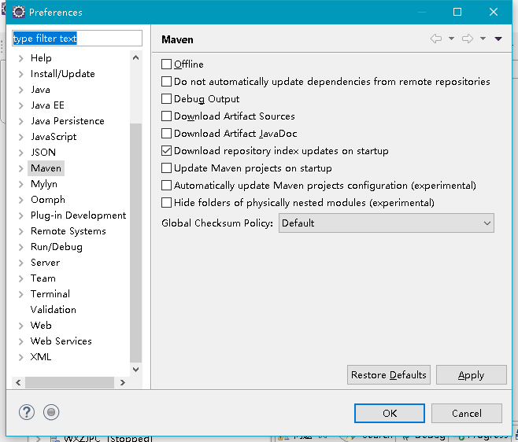
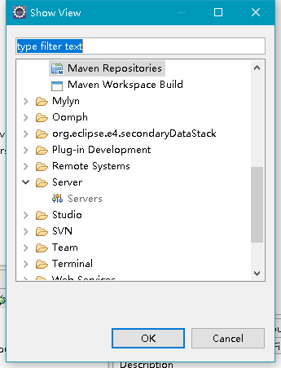
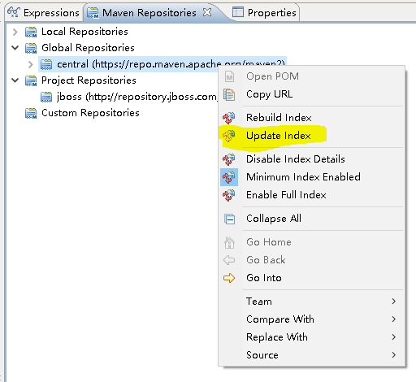
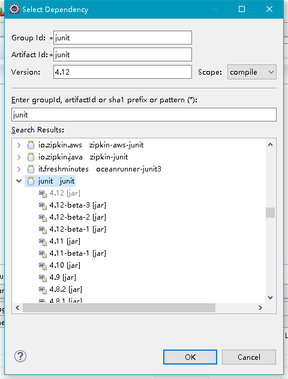
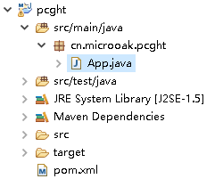
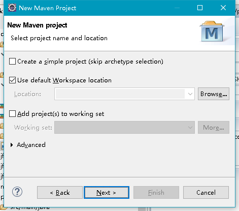
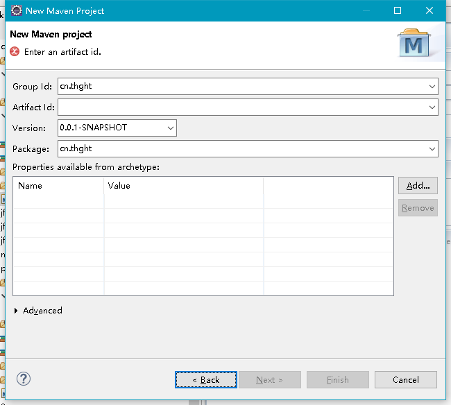
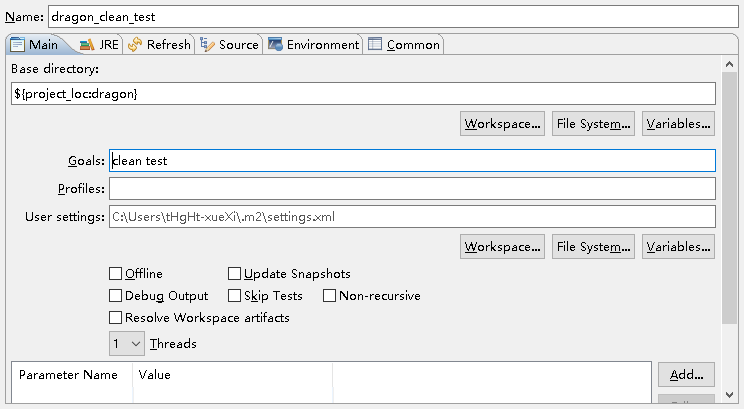

* [如何创建一个Web项目](doc/创建web项目.md)
* [POM.XML中的注意事项](doc/POM的注意事项.md)
* [英文读音含义对照表](doc/英文读音含义对照表.csv)
* [异常处理](doc/异常处理.md)

# 第七章 生命周期和插件 P113
* 生命周期 和 插件 两者协同工作, 密不可分

## 7.1 何为生命周期

* Maven的生命周期为了对所有的构建过程进行抽象和统一. Maven吹牛逼开始: '
* Maven的生命周期包含:
  * 项目的清理
  * 初始化
  * 编译
  * 测试
  * 打包
  * 集成测试
  * 验证
  * 部署
  * 站点生成
* 在生命周期的各阶段,都是由插件来实现的.

## 7.2 生命周期详解

### 7.2.1 三套生命周期
* 每个生命周期包含一些有顺序阶段(phase),后一阶段依赖前一阶段
* 三套生命周期相互独立 , 互不影响

### 7.2.2 clean生命周期
* 目的: 清理项目
1. pre-clean : 执行一些清理前需要完成的工作
2. clean : 清理上一次构建生成的文件.
3. post-clean : 执行一些清理后需要完成的工作.

### 7.2.3 default生命周期
* 真正构建时所需要执行的所有步骤:
1. validate
2. initialize
3. generate-sources
4. process-sources : 处理项目主资源文件
  * 一般是对src/main/resources 目录的内容进行变量替换等工作后, 复制到项目输出的主classpath目录中.
5. generate-resources
6. process-resources
7. compile : 编译项目的主源码
  * 一般是编译src/main/java目录下的Java文件至项目输出的主classpath目录中
8. process-classes
9. generate-test-sources
10. process-test-sources: 处理项目测试资源文件
  * src/test/resources
11. generate-test-resources
12. process-test-resources
13. test-compile : 编译项目的测试代码
  * src/test/java
14. process-test-classes
15. test 使用单元测试框架进行测试
16. prepare-package
17. package : 接受编译好的代码,打包成可发布的格式,如jar
18. pre-integration-test
19. integration-test
20. post-integration-test
21. verify
22. install : 将包安装到Maven本地仓库,
23. deploy : 将最终包复制到远程仓库.

### 7.2.4 site生命周期
* 目的: 建立和发布项目站点
1. pre-site : 执行一些在生成项目站点前需要完成的工作
2. site : 生成项目站点文档
3. post-site : 执行一些之后的工作
4. site-deploy : 发布到服务器上

### 7.2.5 命令行与生命周期
* mvn clean : clean生命周期 
* 注意 clean 只是让生命周期运行到 clean阶段, post-clean阶段没有运行.
* mvn clean install : clean生命周期到clean阶段, default生命周期到install阶段

## 7.3 插件目标
插件并不是为了一个目标而开发的, 一个插件会有多个目标.

## 7.4 插件绑定
* 生命周期与插件的目标相互绑定.
插件名:插件目标(生命周期阶段)

### 7.4.1 内置绑定
* 默认的插件绑定
* 有些生命周期的阶段是有插件绑定的,有些没有.

|生命周期階段|插件目標|
|---|---|
|pre-clean||
|clean|maven-clean-plugin:clean|
|post-clean||
|pre-site||
|site|maven-site-plugin:site|
|post-site||
|site-deploy|maven-site-plugin:geploy|

|生命周期階段|插件目標|执行任务|
|---|---|---|
|process-resources|maven-resources-plugin:resources|复制主资源文件至输出目录|
|compile|maven-compiler-plugin:compile|编译主代码至主输出目录|
|process-test-resources|maven-resources-plugin:testResources|复制测试资源文件至测试输出目录|
|test-compile|maven-compiler-plugin:testCompile|编译测试代码至测试输出目录|
|test|maven-surefire-plugin:test|执行测试用例|
|package|maven-jar-plugin:jar|创建项目jar包|
|install|maven-install-plugin:install|将项目输出构件安装到本地仓库|
|deploy|maven-deploy-plugin:deploy|将项目输出构件部署到远程仓库|


### 7.4.2 自定义绑定  P121
* 定义一个可以把源码作为一个源码jar包的插件

```xml
<bulid>
  <plugins>
    <plugin>
      <groupId>org.apache.maven.plugins</groupId>
      <artifactId>maven-source-plugin</artifactId>
      <version>2.1</version>
      <executions>
        <execution>
          <id>attach-sources</id>
          <phase>verify</phase>
          <goals>
            <goal>jar-no-fork</goal>
          </goals>
        </execution>
      </executions>
    </plugin>
  </plugins>
</bulid>

```


* POM 的 `<build>` 元素下的 `<plugins>` 子元素中生命插件的使用.
* 插件也有 GAV  , 应该生命一个非快照版本
* `<executions>` 元素下每个 `<execution>` 子元素可以用来配置执行一个任务.
* 通过 `<phase>` 将任务绑定到 生命周期的某个阶段上
* 通过 `<goals>` -> `<goal>` 配置指定要执行的**插件目标**
* 很多**插件目标**都有默认绑定阶段, 即使不指定 `<goal>` 也会在默认的阶段运行.

> ## 注意空格, 空格是大坑!!
> mvn help:describe -D plugin=org.apache.maven.plugins:maven-source-plugin:2.1.1 -D detail

* 如果多个插件绑定到同一个阶段,声明的先后顺序决定了执行顺序.  

## 7.5 插件配置
* 配置插件目标的参数, 进一步调整插件目标所执行的任务.

### 7.5.1 命令行插件配置
* -D 参数键=参数

### 7.5.2 POM中插件全局配置
* 配置编译的java1.5版本,JVM1.5

```xml
<build>
  <plugins>
    <plugin>
      <groupId>org.apache.maven.plugins</groupId>
      <artifactId>maven-compiler-plugin</artifactId>
      <version>2.1</version>
      <configuration>
        <source>1.5</source>
        <target>1.5</target>
      </configuration>
    </plugin>
  </plugins>
</build>
```


# 第六章 仓库 P94

## 修改了公共配置之后为啥eclipse中没变呢
* 修改了本地库的位置之后,发现eclipse中还是没有变
* **windows -> preferences -> Maven -> user settings -> Global settings**
* 将公共settings设为你安装的Maven目录中的conf目录中的settings.xml文件.

## 6.1 何为仓库
* 构件 : 任何一个依赖,插件,项目构件的输出
* 仓库 : 统一存储所有Maven项目共享的构件之地

## 6.2 仓库的布局
* 任何构件都有唯一的坐标,根据坐标可以定义其在仓库的唯一存储路径
* 路径和最表的关系:

**groupId/artifactId/version/arifactId-version.packaging**

* Maven 是简单文件系统存储, 也就是目录+文件的方式, 方便定位

## 6.3 仓库的分类

* Maven仓库分为两类: 本地仓库和远程仓库
* 查找构建时会首先查看本地仓库, 如果本地仓库找不到, 会去远程仓库找, 发现后下载到本地仓库, 如果还找不到会报错.

* 特殊的远程仓库: 
   * Maven中央仓库
   * 私服 : 局域网内架设的私有的仓库服务器

* 其他公开的远程仓库:
   * Java.net.Maven 库 : http://download.java.net/maven/2/
   * JBoss Maven 库 : http://repository.jboss.com/maven2/

* 分类表

|一级|-|二级|-|三级|
|---|---|---|---|---|
|maven仓库|→|本地库|||
||↘|远程仓库|→|中央仓库|
||||↘|私服|
||||↘|其他公共库|

### 6.3.1 本地仓库
* Maven 是基于坐标使用本地库的依赖文件.
* 默认的本地库 在 用户自己的用户目录下 路径 为 **.m2/repository/** 的仓库目录
   * Windows例: **C:\Users\tHgHt-xueXi\.m2\repository**
   * Linux例: **/home/netcool/.m2/repository**

* 修改本地库的位置
   * 修改settings.xml文件  
      * 在Maven安装目录conf中的是全局配置文件
      * 在用户家目录下 .m2 目录下的 是用户自己的配置文件,这个文件默认是没有的,需要从conf目录里拷贝出一份才有
   
```xml
<settings>
   <localRepository>D:\m2java\repository</localRepository>
</settings>
```

   * 将本地库修改至 **D:\m2java\repository**
   * 原来的那个貌似还有,可以尝试删掉,或者直接移动到新地址

* 通过 mvn install 命令 , 可以把编译好的项目放入到本地库中.

### 6.3.2 远程仓库
* 每个用户只有一个本地仓库, 却可以配置多个远程仓库

### 6.3.3 中央仓库
* **$M2_HOME/lib/maven-model-builder-3.5.jar** 中的 **org/apache/maven/model/pom-4.0.0.xml** 中看到

```xml
  <repositories>
    <repository>
      <id>central</id>
      <name>Central Repository</name>
      <url>https://repo.maven.apache.org/maven2</url>
      <layout>default</layout>
      <snapshots>
        <enabled>false</enabled>
      </snapshots>
    </repository>
  </repositories>
```

* id : 中心库唯一标识
* name : 中心库的名称
* layout : default仓库布局 ,即6.2所提的
* snapshots -> enabled : false 表示不从该中央库下载快照版本的构件

此处Maven吹牛逼一次.

### 6.3.4 私服
* 假设在局域网内, 代理广域网上的远程仓库.

* 私服的好处:
   * 节省外网带宽
   * 加速Maven构建
   * 部署第三方构建
   * 提高稳定性,增强控制
   * 降低中央仓库的负荷

* 建立私服在第9章会提到.

## 6.4 远程仓库的配置
* 在POM中配置远程仓库

```xml
<project>
   ...
   <repositories>
      <repository>
         <id>jboss</id>
         <name>JBoss Repository</name>
         <url>http://repository.jboss.com/maven2/</url>
         <releases>
            <enabled>true</enabled>
         </releases>
         <snapshots>
            <enabled>false</enabled>
         </snapshots>
         <layout>default</layout>
      </repository>
   </repositories>
   ...
</project>
```

* releases -> enabled : true 表示开启JBoss仓库的发布版本下载支持
* snapshots -> enabled : false 表示关闭JBoss仓库的快照版本的下载支持
* releases 和 snapshots 下的另外两个元素
   * updatePolicy : 更新频率
      * daily : 默认 每天更新一次
      * never : 从不更新
      * always : 每次构建都检查更新
      * interval:X : 每隔X分钟检查一次
   * checksumPolicy : 检查**验证和文件**的策略,Maven会检查下载构建时的**校验和文件**,如果**校验和**失败,会执行这里选择的操作.
      * warn : 默认 执行构建时发出警告信息
      * fail : 遇到简要和错误就让构建失败
      * ignore : 完全忽略**校验和**错误

### 6.4.1 远程仓库的认证
* 有些远程仓库需要我们提供认证信息才能访问.
* 可以为仓库设置用户名和密码
* 仓库信息的配置信息可以直接写在POM文件中.认证信息必须配置在settings.xml文件中.

```xml
<settings>
   ...
   <servers>
      <server>
         <id>my-proj</id>
         <username>repo-user</username>
         <password>repo-pwd</password>
      </server>
   </servers>
   ...
</settings>
```

* ~~换句话说: POM.xml配置访问远程仓库的信息.如果你访问的是需要验证信息的远程仓库,在配置的是有就要写上username和password~~
* ~~远程仓库在设置自己的settings的时候可以给自己加一个用户名和密码,来对外来访问进行验证~~
* 应该是这样的, 上面配置的实际上是要访问远程仓库的用户名和密码. 其中id要与POM中的id一致. 也就是说, 你在POM中只是设置了要访问那个远程仓库,而在settings中设置访问这个ID的远程仓库的用户名和密码........
* 你要是想自己搭建一个私服,让别人来访问你,你需要相关软件, 你的本地库是不能被别人直接访问的......

### 6.4.2 部署至远程仓库

* Maven 可以将项目生成的构件部署到仓库中.
* 配置POM 文件

```xml
<project>
  ...
  <distributionManagement>
    <repository>
      <id>proj-releases</id>
      <name>Proj Release Repository</name>
      <url>http://192.168.1.100/content/repositories/proj-releases</url>
    </repository>
    <snapshotRepository>
      <id>proj-snapshots</id>
      <name>Proj Snapshot Reposicory</name>
      <url>http://192.168.1.100/content/repositories/proj-snapshots</url>
    </snapshotRepository>
  </distributionManagement>
  ...
</project>
```

* distributionManagement 的子元素
  * repository  : 表示发布版本构件的仓库
  * snapshotRepository : 快照版本的仓库
  * 都有id , name , url

* 上传的时候需要用户名和密码的时候需要在settings.xml中进行配置.

* **mvn clean deploy**  将项目构建输出的构件部署到配置对应的远程仓库.

## 6.5 快照版本
* 发布版本(稳定版本) 和 快照版本
* **mvn clean install-U** 构建项目时强制Maven更新依赖构建
* 快照版本的编号在仓库中会有一个时间戳,但是使用者不需要关注这个,因为Maven会自动更新快照版本,更新频率在updatePolicy中设定

* 经过完善的测试后  ,  快照版本 改为 发布版本,  表示这个版本稳定了.. 
* 我们应该对我们自己的代码进行 **完善的测试**
* 不要去依赖外部的快照版本, 因为会有不受控制的因素

## 6.6 从仓库解析依赖的机制
1. 当依赖的范围是system的时候,Maven直接从本地文件系统解析构建.
2. 根据依赖坐标计算仓库路径后,尝试直接从本地仓库寻找构建,如果发现相应构建,则解析成功
3. 本地仓库不存在相应构建时,如果依赖的版本是显式的发布版本构建,则遍历所有的远程仓库,发现后,下载并解析使用.
4. 如果依赖版本是 RELEASE 或 LATEST, 则基于更新策略读取所有远程仓库的元数据 groupId/artifactId/maven-metadata.xml, 将其与本地仓库的对应元数据合并后, 计算出RELEASE 或 LATEST 真实的值, 然后基于这个真实的值 执行第2和第3步
5. 如果依赖版本是 SNAPSHOT , 则基于更新策略读取所有远程仓库的元数据 groupId/artifactId/version/maven-metadata.xml, 将其与本地仓库的对应元数据合并后, 得到最新快照版本的值, 然后基于这个值 执行第2和第3步.
6. 如果最后解析得到的构件是时间戳格式的快照, 则赋值器时间戳格式的文件 至 非时间戳格式. 并使用非时间戳格式的构件.

* 当依赖版本不明确时, 如 RELEASE , LATEST 和 SNAPSHOT , Maven会基于更新远程仓库的更新策略来检查更新.
* 仓库配置中(POM)中,与此相关的配置:
  * `<releases><enabled>`
  * `<snapshots><enabled>`
  * 只有仓库开启了对发布版本的支持时,才会访问该仓库的发布版本构件信息, 快照版本同理
  * `<releases><updatePclicy>`
  * `<snapshots><updatePclicy>`
  * 设置更拼的频率

* 仓库元数据 : maven-metadata.xml
  * 发布版本和最新版本,快照版本 , 基于这个文件进行计算
**groupId/artifactId/maven-metadata-local.xml**

```xml
<?xml version="1.0" encoding="UTF-8"?>
<metadata>
  <groupId>cn.thght.dragon</groupId>
  <artifactId>dragon-core</artifactId>
  <versioning>
    <versions>
      <version>0.0.1-SNAPSHOT</version>
    </versions>
    <lastUpdated>20170911020036</lastUpdated>
  </versioning>
</metadata>
```

* 列出了仓库中存在的该构件所有可用的版本
* latest 元素指向最新的版本
* release 元素指向最新的发布版本

* 不建议在POM中添加 LATEST 和 RELEASE 版本的构件,因为会解析出不同的构件造成不确定的问题.
  * Maven3 不再支持插件配置使用LATEST 和 RELEASE, 没有写版本时, 默认是 RELEASE.

* 如果是快照版本时, 会去查下面的这个文件.

**groupId/artifactId/version/maven-metadata-local.xml**

```xml
<?xml version="1.0" encoding="UTF-8"?>
<metadata modelVersion="1.1.0">
  <groupId>cn.thght.dragon</groupId>
  <artifactId>dragon-core</artifactId>
  <version>0.0.1-SNAPSHOT</version>
  <versioning>
    <snapshot>
      <localCopy>true</localCopy>
    </snapshot>
    <lastUpdated>20170911020036</lastUpdated>
    <snapshotVersions>
      <snapshotVersion>
        <extension>jar</extension>
        <value>0.0.1-SNAPSHOT</value>
        <updated>20170911020036</updated>
      </snapshotVersion>
      <snapshotVersion>
        <extension>pom</extension>
        <value>0.0.1-SNAPSHOT</value>
        <updated>20170911020036</updated>
      </snapshotVersion>
    </snapshotVersions>
  </versioning>
</metadata>
```

* 仓库元数据并不一定永远是正确的.
  * 无法解析某些构件
  * 解析得到错误构件
  * 出问题了需要手工使用工具修复.

## 6.7 镜像
* 如果仓库X可以提供仓库Y存储的所有内容,可以认为X是Y的镜像
* ~~http://maven.net.cn/content/groups/public/ 是 中央仓库 http://repo1.maven.ory/maven2/ 在中国的镜像~~ 莫名其妙 进不去了
* 阿里云的 maven 的中央库镜像 : http://maven.aliyun.com/nexus/content/groups/public/

* settings.xml 中 配置 中央库的镜像

```xml
<settings>
  ...
  <mirrors>
    ...
    <mirror>
      <id>alimaven</id>
      <name>aliyun maven</name>
      <url>http://maven.aliyun.com/nexus/content/groups/public/</url>
      <mirrorOf>central</mirrorOf>
    </mirror>
    ...
  </mirrors>
  ...
</settings>
```

* `<mirrorOf>` 值为 central 表示该配置为中央仓库的镜像, 任何对于中央仓库的请求都转至该镜像,

* 镜像 和 私服 搭配使用
  * `<mirrorOf>*</mirrorOf>` : 配置所有远程仓库
  * `<mirrorOf>external:*</mirrorOf>` : 配置所有远程仓库, 使用localhost的除外,使用file:// 协议的除外. 即 匹配所有不在本机上的远程仓库.
  * `<mirrorOf>repo1,repo2</mirrorOf>` : 匹配仓库repo1和repo2, 使用逗号隔开多个远程仓库.
  * `<mirrorOf>*,! repo1</mirrorOf>` : 配置所有的远程仓库, repo1除外, 使用 感叹号 将仓库排除.

* 镜像挂了 , 原来的仓库也无法访问了  !!!


## 6.8 仓库搜索服务
* 几个常用的, 功能强大的公共Maven仓库搜索服务.

### 6.8.1 Sonatype Nexus
* 地址: http://repository.sonatype.org/
* 开源的maven仓库管理软件
* 关键字搜索, 类名搜索, 坐标搜索, 校验和搜索
* 貌似有点慢, 但确实很牛逼.

## ~~6.8.2 jarvana~~ 域名被出售了...........
* ~~地址: http://www.jarvana.com/jarvana/~~

## ~~6.8.3 MVNbrowser~~  访问不了......
* ~~地址: http://www.mvnbrowser.com~~

### 6.8.4 MVNerpository
* 地址: http://mvnrepository.com/
* 界面清新, 关键字搜索, 依赖声明代码片段, 构件下载, 依赖于被依赖关系信息, 构件所包含信息.
* 速度比 6.8.1 速度快. 但是点的比较多.

### 6.8.5 选择合适的仓库搜索服务.

### 6.8.6 eclipse的maven插件也可以提供搜索功能.
* 配置: 
  1. 允许Maven在启动时下载存储库索引更新
  2. 取消"不要自动更新远程存储库中的依赖项"

> Window -> Preferences -> Maven
> * Offline
> * Do not automatically update dependencies from remote repositories  不要自动更新来自远程存储库的依赖项
> * Debug Output
> * Download Artifact Sources
> * Download Artifact JavaDoc
> * Download repository index updates on startup
> * Update Maven projects on startup
> * Automatically update Maven projects configuration(experimental)
> * Hide folders of physically nested modules(experimental)
> Global Checksum Policy: 


  * 详见下图

  

  2. 手动更新仓库索引
    * 打开Maven Repositories 窗口
    * 更新库索引

  


  


* 使用:
  1. 用 Maven POM editor 打开POM.xml
  2. 打开 Dependencies 选项卡, 点击 Add...
  3. 在 Enter groupId, artifactId or sha1 prefix or pattern(*): 框中输入你要找的包名


  


# 第五章 坐标和依赖 P70

## 5.1 何为Maven坐标
坐标元素包括:
* groupId
* artifactId
* version
* packaging
* classifier

## 5.2 坐标详解
* groupId  必填
   * 定义当前Maven项目隶属的实际项目
   * Maven项目 与 实际项目 不是一对一关系
   * groupId不应该对应项目隶属的组织或公司
   * 表示方式与Java包名的方式类似,通常与域名反向一一对应.
* artifactId  必填
   * 定义实际项目中的一个Maven项目(模块)
   * 推荐使用实际项目名称作为前缀.如: dragon-core
* version  必填
   * 定义Maven项目当前所处的版本.
   * 详见第13章
* packaging  选填
   * 定义了Maven项目的打包方式.
   * 默认是jar
   * 如果想生成.war文件,就选择war.
* classifier  无法直接定义
   * 帮助定义构建输出的一些附属构件.
   * 附属构件比如: 
      * javadoc
      * sources
   * 不能直接定义classifier,不是默认生成的,而是附加插件帮助生成的.

## 5.3 account-email
P73  

> [WARNING]  
> [WARNING] Some problems were encountered while building the effective model for com.juvenxu.mvnbook.account:account-email:jar:0.0.1-SNAPSHOT  
> [WARNING] 'build.plugins.plugin.version' for org.apache.maven.plugins:maven-compiler-plugin is missing. @ line 58, column 12  
> [WARNING]  
> [WARNING] It is highly recommended to fix these problems because they threaten the stability of your build.  
> [WARNING]  
> [WARNING] For this reason, future Maven versions might no longer support building such malformed projects.  
> [WARNING]   


## 5.4 依赖的配置

```xml
<project>
...
   <dependencies>
      <dependency>
         <groupId>...</groupId>
         <artifactId>...</artifactId>
         <version>...</version>
         <type>...</type>
         <scope>...</scope>
         <optional>...</optional>
         <exclusions>
            <exclusion>
            ...
            </exclusion>
         ...
         </exclusions>
      </dependency>
   ...
   </dependencies>
...
</project>
```

* groupId , artifactId , version : 依赖的基本坐标
* type : 依赖的类型, 对应项目坐标定义的packaging.  默认是jar
* scope : 依赖范围, 见5.5节
* optional : 标记依赖是否可选, 见5.8节
* exclusions : 用来排除传递性依赖, 见5.9.1节

## 5.5 依赖范围
Maven有3种classpath
* 编译classpath
* 测试classpath
* 运行classpath
Maven有6种依赖范围:
* compile : 编译依赖范围, 默认,三种classpath都有效.
* test : 测试依赖范围, 只对测试classpath有效  
   * JUnit  只在测试时需要
* provided : 已提供依赖范围. 对编译和测试classpath有效.  
   * servlet-api  容器会提供,所以运行时不需要
* runtime : 运行时依赖范围. 对测试和运行classpath有效.
   * JDBC驱动实现. 项目主代码的编译只需要JDK提供的JDBC接口.
* system : 系统依赖范围.与provided一样.但需要在systemPath元素显式指定依赖文件的路径.
   * 不依赖Maven库解析,可能会造成不可移植.

```xml
<dependency>
	<groupId>javax.sql</groupId>		
   <artifactId>jdbc-stdext</artifactId>
	<version>2.0</version>
   <scope>system</scope>
   <systemPath>${java.home}/lib/rt.jar</systemPath>
</dependency>
```

* import (Maven 2.0.9及以上): 导入依赖范围. 不会对三种classpath产生影响. 详见8.3.3

|依赖范围|编译|测试|运行|例子|
|---|---|---|---|---|
|**compile**|√|√|√|spring-core|
|**test**|-|√|-|JUnit|
|**provided**|√|√|-|servlet-api|
|**runtime**|-|√|√|JDBC驱动实现|
|**system**|√|√|-|本地的,Maven之外的类库|

## 5.6 传递性依赖

### 5.6.1 何?
* Maven 会帮你把你需要的依赖包的依赖找到
* 依赖包的依赖会传递依赖包的依赖范围.

### 5.6.2 传递性依赖和依赖范围
看上去很神秘的表

| |compile|test|provided|runtime|
|---|---|---|---|---|
|compile|compile|-|-|runtime|
|test|test|-|-|test|
|provided|provided|-|provided|provided|
|runtime|runtime|-|-|runtime|

其实我觉得不用太在意这些.

## 5.7 依赖调节
* 当传递性依赖造成问题的时候,我们需要知道该传递性依赖是从哪条依赖路径引入的. O-O
* 依赖调节原则:
   1. 路径最近者优先  
      * A -> B -> C -> X(1.0)
      * A -> D -> X(2.0)    被使用
   2. Maven2.0.9开始, 第一声明者优先
      * A -> B -> X(1.0)    被使用
      * A -> C -> X(2.0)

## 5.8 可选依赖
* `<optional>`元素表示这个依赖包只针对本项目,如果其他项目需要依赖本项目,被这个元素标记的包不会被其他项目使用.
* 换句话说,我声明了就我能用,你想用你自己声明,让我帮忙我也不给你用.

## 5.9 最佳实践
* 排除依赖
   * `<exclusions>`
   * `<exclusion>`
   * 排除 某个依赖包的依赖
   * 自己依赖自己想依赖的依赖.

* 归类依赖
   * `<properties>` ,需要修改版本时,修改一处就可以了
   * 定义一个变量
`<springframework.version>2.5.6</springframework.version>`
   * 引用变量
`<version>${springframework.version}</version>`

* 优化依赖 P90
   * 已解析依赖,经过Maven规则自动解析,对依赖冲突进行调节,得到所有构建只有唯一的版本在依赖中存在
   * 查看当前项目中的已解析依赖 : **mvn dependency:list**
   * 查看当前项目的依赖树: **mvn dependency:tree**
   
> 执行命令结果  
> [INFO] com.juvenxu.mvnbook.account:account-email:jar:0.0.1-SNAPSHOT  
> [INFO] +- junit:junit:jar:3.8.1:test  
> [INFO] +- org.springframework:spring-core:jar:2.5.6:compile  
> [INFO] |  \- commons-logging:commons-logging:jar:1.1.1:compile  
> [INFO] +- org.springframework:spring-beans:jar:2.5.6:compile  
> [INFO] +- org.springframework:spring-context:jar:2.5.6:compile  
> [INFO] |  \- aopalliance:aopalliance:jar:1.0:compile  
> [INFO] +- org.springframework:spring-context-support:jar:2.5.6:compile  
> [INFO] +- javax.mail:mail:jar:1.4.1:compile  
> [INFO] |  \- javax.activation:activation:jar:1.1:compile  
> [INFO] \- com.icegreen:greenmail:jar:1.3.1b:test  
> [INFO]    \- org.slf4j:slf4j-api:jar:1.3.1:test  


   * 展示项目中使用到但没有显式声明的依赖(Used undeclared dependencies); 展示项目中没有被使用,但被显式声明的依赖(Unused declared dependencies). **mvn dependency:analyze**

> 执行结果:  
> [WARNING] Unused declared dependencies found:  
> [WARNING]    org.springframework:spring-core:jar:2.5.6:compile  
> [WARNING]    org.springframework:spring-beans:jar:2.5.6:compile  
> [WARNING]    org.springframework:spring-context:jar:2.5.6:compile  
> [WARNING]    com.icegreen:greenmail:jar:1.3.1b:test  


# 第四章 背景案例  P64


代码的模块化,将功能封装到jar包中,


# 第三章 Maven 初试

## 3.6 m2eclipse 简单使用

### 3.6.1 导入Maven项目

~~file -> import -> general目录~~
~~-> Maven Projects -> Next~~ 
~~-> Import Projects 对话框 -> Browse~~  
~~-> Hello World的根目录~~

上面说的并不靠谱,我导入的方法是:

> file -> import -> Maven目录  
> -> Existing Maven Projects -> Next  
> -> Browse -> 找到Hello World的pom.xml文件所在的目录  
> -> 在Projects框中选择 pom.xml文件 -> Finish  


导入完成后:



* Windows的Maven本地库在:  C:\Users\tHgHt-xueXi\\.m2
* 本地库好大啊,快2个G了.......

### 3.6.2 创建一个Maven项目
file -> new -> Other... -> 选择Maven -> Maven Project



-> Next -> 选择 maven-archetype-quickstart -> Next



### 3.6.3 运行mvn命令
注意: 在IDE中运行mvn时,项目配置的JRE目录必须是JDK,否则会报错:
**No compiler is provided in this environment. Perhaps you are running on a JRE rather than a JDK?**

mvn的命令都在右键点击pom.xml -> run as 中

自建mvn的命令相当于 java run 不同的是可以写入指定命令


## 3.5 使用 Archetype 生成项目骨架
一些Maven的约定:
1. 项目的根目录中放置 pom.xml
2. 在src/main/java目录中放置项目的主代码
3. 在src/test/java目录中放置项目的测试代码

使用Maven提供的  Archetype  来生成项目的骨架


> mvn archetype:generate

执行玩这个命令后, 会下载一堆东西,然后有一些需要配置的内容,然后会生成一个目录

> Choose a number or apply filter (format: [groupId:]artifactId, case sensitive contains): 1030: 	#直接回车  
> Choose org.apache.maven.archetypes:maven-archetype-quickstart version:   
> 1: 1.0-alpha-1  
> 2: 1.0-alpha-2  
> 3: 1.0-alpha-3  
> 4: 1.0-alpha-4  
> 5: 1.0  
> 6: 1.1  
> Choose a number: 6:  #直接回车  
> Downloading: #下载一堆东西  
> Define value for property 'groupId': cn.microoak  
> Define value for property 'artifactId': newPc  
> Define value for property 'version' 1.0-SNAPSHOT: :   
> Define value for property 'package' cn.microoak: : newPc  #这个会影响java目录下的目录结构  
> Confirm properties configuration:  
> groupId: cn.microoak  
> artifactId: newPc  
> version: 1.0-SNAPSHOT  
> package: newPc  
> Y: : #回车确认  
>   
> #生成的目录结构:  
> newPc/  
> newPc/pom.xml  
> newPc/src  
> newPc/src/main  
> newPc/src/main/java  
> newPc/src/main/java/newPc  
> newPc/src/main/java/newPc/App.java  
> newPc/src/test  
> newPc/src/test/java  
> newPc/src/test/java/newPc  
> newPc/src/test/java/newPc/AppTest.java  


----

> mvn clean compile    #进行编译  
> mvn clean test       #进行编译测试    
> mvn clean package    # 进行打包  
> mvn clean install    # 进行安装  


```xml
<?xml version="1.0" encoding="UTF-8"?>
<project xmlns="http://maven.apache.org/POM/4.0.0"
   xmlns:xsi="http://www.w3.org/2001/XMLSchema-instance"
   xsi:schemaLocation="http://maven.apache.org/POM/4.0.0
      http://maven.apache.org/maven-v4_0_0.xsd">

   <modelVersion>4.0.0</modelVersion>
   <groupId>cn.microoak</groupId>
   <artifactId>pc</artifactId>
   <version>1.0-SNAPSHOT</version>
   <name>Maven Hello World Project</name>
   <dependencies>
      <dependency>
         <groupId>junit</groupId>
         <artifactId>junit</artifactId>
         <version>4.7</version>
         <scope>test</scope>
      </dependency>
   </dependencies>
   <build><plugins><plugin>
      <groupId>org.apache.maven.plugins</groupId>
      <artifactId>maven-shade-plugin</artifactId>
      <version>1.2.1</version>
      <executions><execution>
         <phase>package</phase>
         <goals><goal>shade</goal></goals>
         <configuration><transformers>
            <transformer implementation="org.apache.maven.plugins.shade.resource.ManifestResourceTransformer">
               <mainClass>        
                  cn.microoak.pc.HelloWorld
               </mainClass>
            </transformer></transformers>
         </configuration>
      </execution></executions>
   </plugin></plugins></build>
</project>
```

## 关于可运行的.jar文件
1. 在pom.xml文件中配置 plugin
2. 执行install命令后,会在target目录下看到两个.jar文件
   * pc-1.0-SNAPSHOT.jar  可执行的jar
   * original-pc-1.0-SNAPSHOT.jar  不可执行的jar
3. 执行的方法  :


> $ java -jar pc-1.0-SNAPSHOT.jar  
> Hello Maven!  


## 关于打包  
1. 打包之后,会在target目录下出现一个.jar的文件.
2. 貌似上面这四个命令都是包含的关系,下面的命令包含上面的命令.
3. install命令会编译,测试,打包,安装一系列的动作.


> [INFO] --- maven-jar-plugin:2.4:jar (default-jar) @ pc ---  
> [INFO] Building jar: /home/netcool/hello-world/target/pc-1.0-SNAPSHOT.jar  
> [INFO]   
> [INFO] --- maven-install-plugin:2.4:install (default-install) @ pc ---  
> [INFO] Installing /home/netcool/hello-world/target/pc-1.0-SNAPSHOT.jar to /home/netcool/.m2/repository/cn/microoak/pc/1.0-SNAPSHOT/pc-1.0-SNAPSHOT.jar  
> [INFO] Installing /home/netcool/hello-world/pom.xml to /home/netcool/.m2/repository/cn/microoak/pc/1.0-SNAPSHOT/pc-1.0-SNAPSHOT.pom  

4. 最终有两个文件被放到了本地库中,一个是.jar文件,一个是.pom文件.他们被放到了**.m2/repository/cn/microoak/pc/1.0-SNAPSHOT/**中


关于 test 这个命令的一些知识
1. 不需要把要测试的.java文件放到src/test/java对应的目录中,但是 测试的.java文件要把包放到要测试的.java文件对应的包中,否则报找不到文件的错误.
2. 运行 test 命令以后, 会在最后看到 TESTS 的结果

> -------------------------------------------------------  
>  T E S T S  
> -------------------------------------------------------  
> Running cn.microoak.pc.HelloWorldTest  
> Tests run: 1, Failures: 0, Errors: 0, Skipped: 0, Time elapsed: 0.118 sec  
>  
> Results :  
>  
> Tests run: 1, Failures: 0, Errors: 0, Skipped: 0  
>  


貌似 没有错误就表示合格了.
如果测试没通过, 会直接报错!就像下面一样

> -------------------------------------------------------  
> T E S T S  
> -------------------------------------------------------  
> Running cn.microoak.pc.HelloWorldTest  
> Tests run: 1, Failures: 1, Errors: 0, Skipped: 0, Time elapsed: 0.108 sec <<< FAILURE!  
> testSayHello(cn.microoak.pc.HelloWorldTest)  Time elapsed: 0.03 sec  <<< FAILURE!  
> org.junit.ComparisonFailure: expected:`<Hello Maven![]>` but was:`<Hello Maven![t]>` 
> 	at org.junit.Assert.assertEquals(Assert.java:123)  
> 	at org.junit.Assert.assertEquals(Assert.java:145)  
> 	at cn.microoak.pc.HelloWorldTest.testSayHello(HelloWorldTest.java:11)  
> 	at sun.reflect.NativeMethodAccessorImpl.invoke0(Native Method)  
> 	at sun.reflect.NativeMethodAccessorImpl.invoke(NativeMethodAccessorImpl.java:62)  
> 	at sun.reflect.DelegatingMethodAccessorImpl.invoke(DelegatingMethodAccessorImpl.java:43)  
> 	at java.lang.reflect.Method.invoke(Method.java:498)  
> 	...  
> 	at org.apache.maven.surefire.booter.ForkedBooter.runSuitesInProcess(ForkedBooter.java:115)  
> 	at org.apache.maven.surefire.booter.ForkedBooter.main(ForkedBooter.java:75)  
>   
>   
> Results :  
>   
> Failed tests:   testSayHello(cn.microoak.pc.HelloWorldTest): expected:`<Hello Maven![]>` but was:`<Hello Maven![t]>`  
>   
> Tests run: 1, Failures: 1, Errors: 0, Skipped: 0  
>  

有几个疑问:
1. maven并没有像书上说的去src/main/java中取源代码,同样的,也没有去src/test/java中取测试代码
   * 回答这个问题, maven 确实去src/main/java中获取.java代码,然后把它编译成.class文件.
   * src/main/resources   这个目录貌似应该是html资源. 会被直接拿到编译后的文件中.
3. java的包应该从哪里创建?
   * 编译 只针对pom.xml中的路径,而编译后的路径不一定是原来的路径,而是你pom中编写的路径
   * 如果你在java文件中的package 写的是**cn.microoak.helloworld**,
   name即使你把放在**cn.microoak.pc**中,他在编译完成后也会放到**cn.microoak.helloworld**
   * 他会把java下的.java文件全部便以为.class文件.
4. 按照书上说的,并没有创建.class文件
   * 只有把.java文件放到src/main/java中的文件才会被编译

---
在3.2 编写主代码中提到了要在src/main/java中创建文件 com/xxxx/xxx.java
所以java的包应该从这个目录创建

执行完mvn命令之后, 会在pom.xml所在的目录里创建一个target的目录.

~~~这个目录里面只有.java文件.~~~

在/home/netcool/hello-world/target/maven-status/maven-compiler-plugin/compile/default-compile
目录中, 可以看到
**createdFiles.lst  inputFiles.lst**
* createdFiles.lst 是被创建的.class文件列表
* inputFiles.lst  是被编译的.java文件列表


